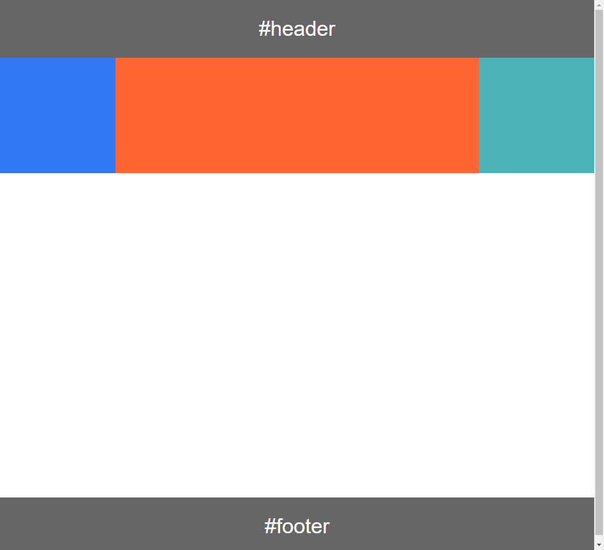

- [两列左侧定宽右侧自适应布局](#两列左侧定宽右侧自适应布局)
- [两列左侧自适应右侧定宽布局](#两列左侧自适应右侧定宽布局)
- [三列中间自适应布局之一](#三列中间自适应布局之一)
- [三列中间自适应布局:实现二:__圣杯布局__](#三列中间自适应布局:实现二:__圣杯布局__)
- [三列中间自适应布局:实现三：__双飞翼布局__](#三列中间自适应布局:实现三:__双飞翼布局__)


# CSS布局
#### 两列左侧定宽右侧自适应布局
__HTML结构__
```html
	<div class="box">
		<div class="left">
			<h4>左侧定宽</h4>
		</div>
		<div class="right">
			<div class="right_content">
				<h4>右侧自适应</h4>
			</div>
		</div>
	</div>
```
CSS设置要点
- left部分左浮动`float:left`、相对定位`position:relative`
- right部分设置`display:inline-block`（不兼容IE6、7，无需清浮动）或者设置`float:right`(兼容到IE6,此时需要父元素清浮动以正确设置父元素的高度)
- right部分设置宽度100%`width:100%;`
- right部分设置margin-left负值(该值为左侧定宽值),这样就可以将left部分和right部分在一行中显示
- 内容content部分设置margin-left正值（该值为左侧定宽值加上左侧和右侧的间距值），这样left部分和right的内容展示区就不会有重叠覆盖部分了
- 为什么要设置margin负值然后又设置正值？答：为了将left部分和right自适应部分都包含在父元素中，防止溢出，如果父元素设置了溢出隐藏，那么很可能会将一部分原本可见的内容给隐藏掉
- 关于命名，一般将left定宽部分的类名为side,将right自适应部分命名为main-content

#### 两列左侧自适应右侧定宽布局

__HTML结构__
```HTML
	<div class="box">
		<div class="left">
			<div class="left-content">
				<h4>左侧自适应</h4>
			</div>
		</div>
		<div class="right">
			<h4>右侧定宽</h4>
		</div>
	</div>
```
CSS设置要点：类似1.两列左侧定宽右侧自适应布局，只是左右颠倒了

#### 三列中间自适应布局之一

__HTML结构__
```html
	<div class="container clear-fix">
		<div class="side">
		</div>
		<div class="main">
			<div class="main-content">
			</div>
		</div>
		<div class="wrap">
		</div>
	</div>
```
__CSS设置要点：__

如上设置好HTML结构之后，准备工作：

- .side，.main,.wrap都设置`height:400px`,设置背景色，设置.side和.wrap的定宽，设置.main的宽为`width:100%`

准备工作做好之后大概就这样：


接下来我们继续

- .side和.main都设置：`float:left`,.wrap设置`float:right`设置完之后大概就：


- .side部分设置`margin-left:-200px`将main部分“拉”上来.wrap部分设置`margin-left:-200px`将自己"拉"上去，此时，三部分都已经在同一行中排列了


- .main-content部分设置`margin-left:200px;margin-right:200px`目的是为了三部分的内容展示区域发生重叠，然后就可以看到：


- 建议：body部分设置一个最小宽度：`min-width:600px;`,最小宽度的值为：两倍左侧定宽加上右侧定宽

#### 三列中间自适应布局:实现二:__圣杯布局__

__简单介绍__下圣杯布局：听说圣杯布局是国外技术人提出的，可以看[这篇文章](https://alistapart.com/article/holygrail),与上面实现一方式不同的是，我们的HTML的结构中，main部分被放到了最前面，得以优先加载（通常对大多数网站来说中间的部分是主要内容）

__HTML结构__
```html
	<div class="container clear-fix">
		<div class="main"></div>
		<div class="side"></div>
		<div class="wrap"></div>
	</div>
```

__CSS设置要点__

- 准备工作：给三部分设置高度，背景色，两边的定宽，中间的宽度为100%;


- .container设置`padding-left:左侧定宽值`，`padding-right:右侧定宽值`,同时自适应部分和定宽部分都`float:left`,`position:relative`


- .side设置`margin-left:-100%;`，将左侧定宽“拉”上去，同时`right:左侧定宽值`（第二步已经设置了`position:relative`），这样就左侧定宽部分就“归位“了


- .wrap部分设置`margin-right:-100%;`这样，右侧定宽部分也完整”归位了“



- 最后坑：body设置最小宽度，最小宽度为2*左侧定宽+右侧定宽，不然的话body宽度小于此值的时候布局会崩掉

#### 三列中间自适应布局:实现三:__双飞翼布局__

__简单介绍__下双飞翼布局：双飞翼布局始于淘宝UED，实现方式跟圣杯布局类似但又稍有不同，所谓双飞翼布局，就是把三列内容比作一只大鸟，左右两边就是他的两只翅膀，中间是身体。
HTML组织方面，我们把main中间自适应部分放到最前面，方便这样就可以得以优先加载
```html
<div class="container clear-fix">
	<div class="main">
		<div class="main-content"></div>
	</div>
	<div class="side"></div>
	<div class="wrap"></div>
</div>
```
CSS设置要点：

- 准备工作，设置左右两边地定宽，中间100%宽度，背景色，三部分的高度


- 三部分同时设置`float:left`


- 接下来我们将左侧拉上去，回归到我们想让他待的地方去：`margin-left:-100%;`


- 接下类就是将右侧归位：`margin-left:右侧定宽值;`,这样，最终的效果图就出来了


- 但是我们如果用chrome查看他们的盒模型的时候便会发现中间跟左右两部分发生重叠了，于是，我们需要在main-content部分设置margin-left和margin-right，这样，当里面放上了真正的内容的时候，就不会被覆盖了，效果跟上一步一样
- 最后，还是那个建议，设置最小宽度，哈哈

总结：双飞翼布局跟圣杯布局相似，但是又稍有不同，他们的结构都是一样（双飞翼的自适应部分多了个子元素）的，差异点就在于他们将三部分正确归位的方式有所不同，圣杯布局使用相对定位和padding，双飞翼布局多制造了一个子元素（padding和margin都可以）